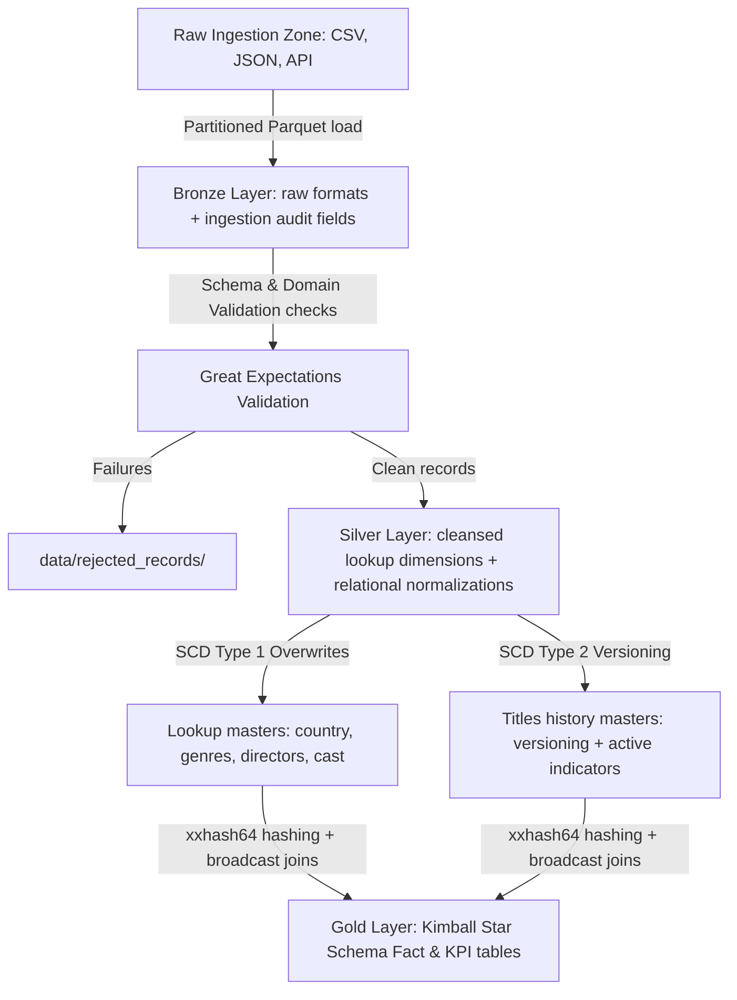

# Netflix Data Engineering Pipeline (Medallion Architecture)

A production-ready, end-to-end data engineering pipeline implementing the Medallion Architecture (Bronze, Silver, Gold layers) using PySpark, Great Expectations, PostgreSQL, Docker, and Apache Airflow.

---

## 1. Project Overview
This project parses and cleans raw movie and TV show titles dataset logs from Netflix, subjects raw input records to enterprise quality validations via Great Expectations, normalizes the relational elements into lookup tables, applies Slowly Changing Dimension updates, and assembles a Kimball Star Schema Gold dimensional model populated with aggregate KPIs.

---

## 2. Technology Stack
*   **Core Execution:** Python 3.13.9, PySpark 3.5.1
*   **Validation Rules:** Great Expectations 0.18
*   **Warehouse / Target:** PostgreSQL, Parquet (partitioned columnar storage)
*   **Workflow Orchestration:** Apache Airflow, Docker Compose
*   **Unit Tests Suite:** PyTest, Unittest Mocks

---

## 3. Architecture & Data Flow



---

## 4. Complete Project Directory Structure

```text
netflix-project/
├── docker/
│   ├── postgres/
│   │   └── init.sql                 # Database credentials and relational setups
│   ├── spark/
│   │   └── Dockerfile               # PySpark container containing PostgreSQL drivers
│   ├── airflow/
│   │   └── dags/
│   │       └── netflix_dag.py       # Orchestrated daily processing DAG dependencies
│   └── docker-compose.yml           # Multi-node network compose (Airflow, Spark, PG)
├── src/
│   ├── config/
│   │   ├── pipeline_config.yaml     # System paths loaders parameters
│   │   └── data_quality_rules.yaml  # Config-driven GE check specifications
│   ├── utils/
│   │   ├── config_loader.py         # Recursive configurations parser
│   │   ├── logger.py                # Auditing JSON logs formatter
│   │   ├── retry.py                 # Exponential backoff retry wrapper
│   │   ├── notifications.py         # Failure notification mock alerts interface
│   │   └── watermark_manager.py     # Checkpoint watermarks reader & committer
│   ├── Ingestion/
│   │   ├── ingestion_engine.py      # landing readers factory
│   │   └── ingest_raw.py            # landing to raw zones loader
│   ├── bronze/
│   │   ├── bronze_loader.py         # Partitioned parquet bronze writer
│   │   └── run_bronze_load.py       # Bronze loader runner script
│   ├── quality/
│   │   ├── dq_framework.py          # Programmatic GE rules execution wrapper
│   │   └── run_validation.py        # DQ checking execution script
│   ├── silver/
│   │   ├── silver_transformer.py    # Standardizer and normalization parser
│   │   ├── run_silver_load.py       # Silver loader runner script
│   │   ├── scd_type1.py             # SCD Type 1 lookup tables processor
│   │   ├── scd_type2.py             # SCD Type 2 titles history versioner
│   │   ├── incremental_engine.py    # Incremental Watermarks Pipeline Orchestrator
│   │   └── run_incremental_pipeline.py # Incremental Orchestrator runner script
│   └── gold/
│       ├── gold_warehouse.py        # Star Schema fact and dimension compiler
│       └── run_gold_load.py         # Gold loader runner script
├── database/
│   ├── metadata_schema.sql          # Logging schema and runs telemetry DDL
│   ├── audit_queries.sql            # Telemetry analytics SQL queries
│   └── powerbi_views.sql            # Ready-to-use business analytical KPI views
├── tests/
│   ├── test_*.py                    # Automated unit, integration, and E2E checks
│   └── ...
├── .gitignore                       # Clean packaging exclusions parameters
├── LICENSE                          # MIT open source credentials
├── CONTRIBUTING.md                  # Collaboration developer instructions
└── requirements.txt                 # Pipeline libraries list
```

---

## 5. Execution Instructions

### Run the Pipeline Orchestrator:
*   **Incremental Run:** Only processes updates since last watermark check:
    ```powershell
    python src/silver/run_incremental_pipeline.py
    ```
*   **Force Full Run:** Loads all historic files:
    ```powershell
    python src/silver/run_incremental_pipeline.py --force-full
    ```

### Run Tests:
```powershell
python -m pytest tests/
```

---

## 6. Future Improvements
*   **Slack Alerts:** Implement webhook triggers inside `NotificationManager`.
*   **PostgreSQL Telemetry Hook:** Append runtime logs into PG database schema dynamically.
*   **Airflow KubernetesPodOperator:** Scale out processing executors across nodes.
