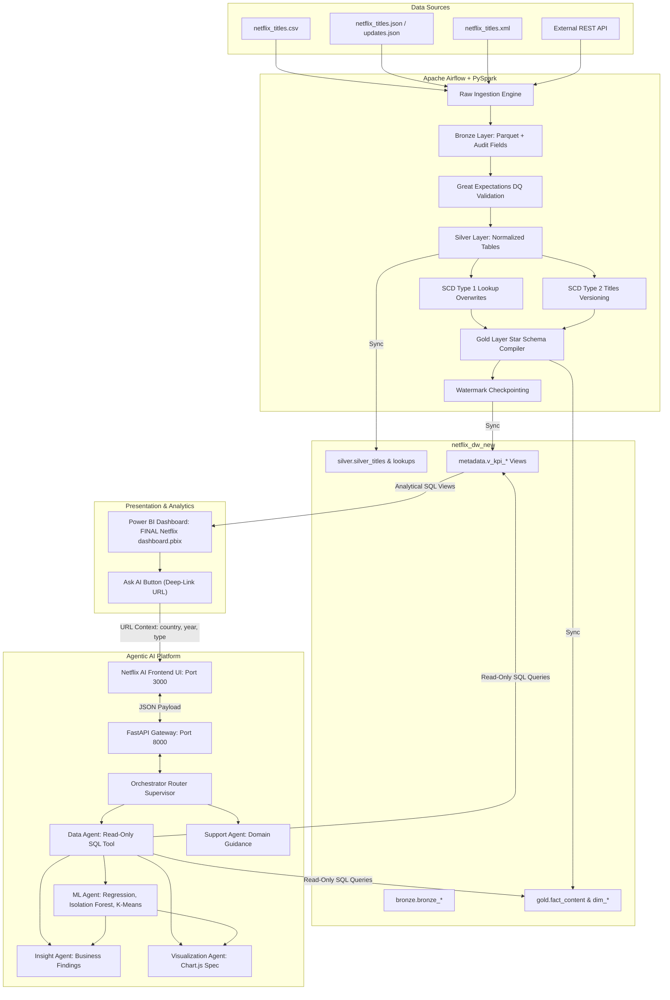
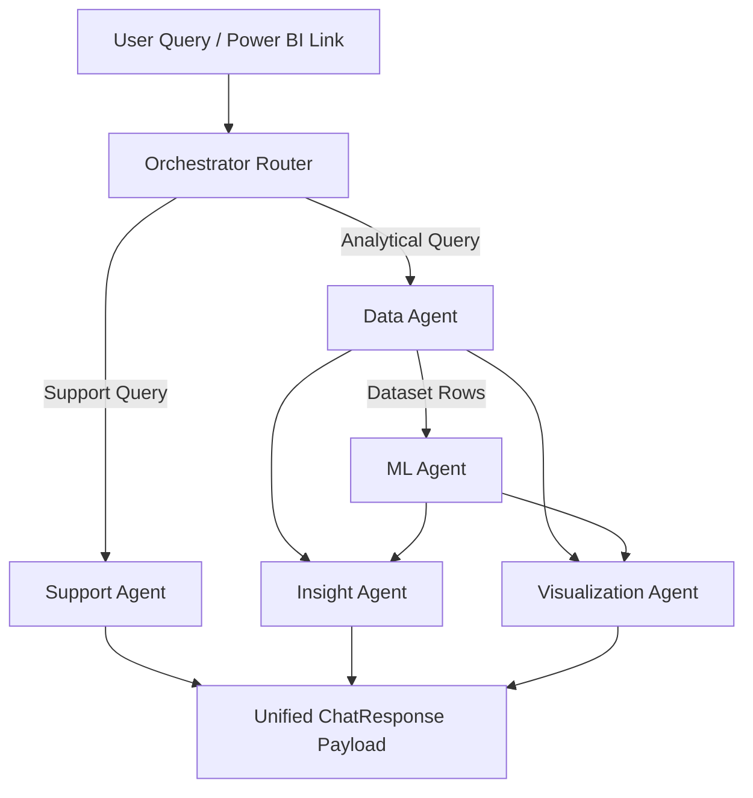

# Netflix Project - Final Architecture & Multi-Agent Specification

## 1. System Overview

The **Netflix Customer Analysis** system is an end-to-end Enterprise Data Platform combining:
1. **Medallion Data Engineering Pipeline** (PySpark 3.5.1, Great Expectations, Apache Airflow, PostgreSQL).
2. **PostgreSQL Gold Data Warehouse** (Kimball Star Schema & analytical metadata views).
3. **Power BI Business Intelligence Dashboard** (Presentation layer).
4. **Agentic AI Analytics Platform** (6 Autonomous AI Agents, FastAPI, Modern Dark Frontend).

---

## 2. Complete System Architecture Flow

---

## 3. Data Engineering Architecture (Medallion Layers)

| Layer | Storage Format / Schema | Key Tables / Objects | Purpose |
|---|---|---|---|
| **Landing / Raw** | Files (`data/raw/`) | CSV, JSON, XML, Updates JSON | Raw landed logs and partner updates. |
| **Bronze** | Parquet + PG `bronze` | `bronze_netflix_csv`, `bronze_netflix_incremental_json` | Standardized schema with `_batch_id`, `_ingested_at`, `_load_type` lineage fields. |
| **Quality** | Great Expectations | `run_validation.py`, `data_quality_rules.yaml` | Validates null rules, data types, and uniqueness assertions. |
| **Silver** | Relational + PG `silver` | `silver_titles` (SCD 1), `silver_titles_scd2` (SCD 2), `silver_country`, `silver_genres`, `silver_directors`, `silver_cast` | Cleansed, normalized lookup masters and version-tracked historical records. |
| **Gold** | Star Schema + PG `gold` | `fact_content` (25,879 rows), `dim_title` (8,807 rows), `dim_director`, `dim_country`, `dim_genre`, `dim_rating`, `dim_type`, `dim_date` | Aggregated Kimball Star Schema dimensional data model for high-speed OLAP analytics. |
| **Metadata** | Views + PG `metadata` | `v_kpi_general_summary`, `v_kpi_country_distribution`, `v_kpi_genre_distribution`, `v_kpi_top_directors`, `v_kpi_rating_distribution`, `v_kpi_release_trends` | Pre-built analytical views consumed by Power BI and Netflix AI. |

---

## 4. Agentic AI Architecture (6-Agent Multi-Agent System)

### Agent Specification Matrix

#### 1. Orchestrator Router (`apps/ai_backend/agents/orchestrator.py`)
- **Purpose:** Intent classification & task router supervisor.
- **Input:** `ChatRequest` (query string, context filter).
- **Output:** Execution plan, trajectory steps, unified `ChatResponse`.
- **Invoked When:** Every incoming user request.
- **Example:** Classifies `"Predict content growth."` → `Data + ML + Insight + Visualization`.

#### 2. Data Agent (`apps/ai_backend/agents/data_agent.py`)
- **Purpose:** Generates and executes read-only SQL queries against Gold schema and metadata views.
- **Input:** Query string, Power BI context parameters (`country`, `year`, `type`).
- **Output:** Query dataset rows, validated SQL code.
- **Tools Used:** `run_sql_query` read-only tool (`sqlparse` security scanner).
- **Invoked When:** Analytical questions requiring catalog data, rankings, trends, or counts.
- **NOT Invoked When:** Non-analytical support questions (e.g. "What does Movie Ratio mean?").

#### 3. ML Agent (`apps/ai_backend/agents/ml_agent.py`)
- **Purpose:** Executes machine learning models on extracted dataset rows.
- **Input:** Dataset rows from Data Agent.
- **Output:** Model metrics ($R^2$, slope), 5-year predictions, anomalies list, cluster labels.
- **Tools Used:** `scikit-learn` (`LinearRegression`, `IsolationForest`, `KMeans`), `StandardScaler`, `numpy`.
- **Invoked When:** Predictive forecasting, anomaly detection, or clustering requests.
- **NOT Invoked When:** Simple counts or standard domain questions.

#### 4. Support Agent (`apps/ai_backend/agents/support_agent.py`)
- **Purpose:** Answers domain definitions, metric formulas, and architecture guidance.
- **Input:** User prompt string.
- **Output:** Markdown formatted answer without executing database SQL.
- **Invoked When:** Questions about "Movie Ratio", "Gold Layer", "What can AI do?".
- **NOT Invoked When:** Analytical data retrieval questions.

#### 5. Insight Agent (`apps/ai_backend/agents/insight_agent.py`)
- **Purpose:** Synthesizes SQL rows and ML outputs into structured business takeaways.
- **Input:** Query, SQL query string, data rows, ML results.
- **Output:** Formatted Markdown answer (**Answer**, **Key Insights**, **Method**).
- **Invoked When:** Analytical queries requiring business interpretation.

#### 6. Visualization Agent (`apps/ai_backend/agents/viz_agent.py`)
- **Purpose:** Determines optimal chart type and structures ChartSpec objects.
- **Input:** Data rows, SQL query, ML results.
- **Output:** `ChartSpec` JSON (`bar`, `horizontal_bar`, `line`, `donut`).
- **Invoked When:** Visualizable data (rankings, trends, compositions) is returned.

---

## 5. Security & Safety Architecture

- **Read-Only Database Connection:** Only `SELECT` and `WITH` statements are executed against PostgreSQL.
- **Prompt Keyword Scanner:** Rejects prompts containing DDL/DML keywords (`DROP`, `DELETE`, `UPDATE`, `INSERT`, `ALTER`, `TRUNCATE`, `CREATE`, `GRANT`, `REVOKE`).
- **Sanitized Exceptions:** Internal tracebacks, secrets, and file paths are withheld from client responses.
